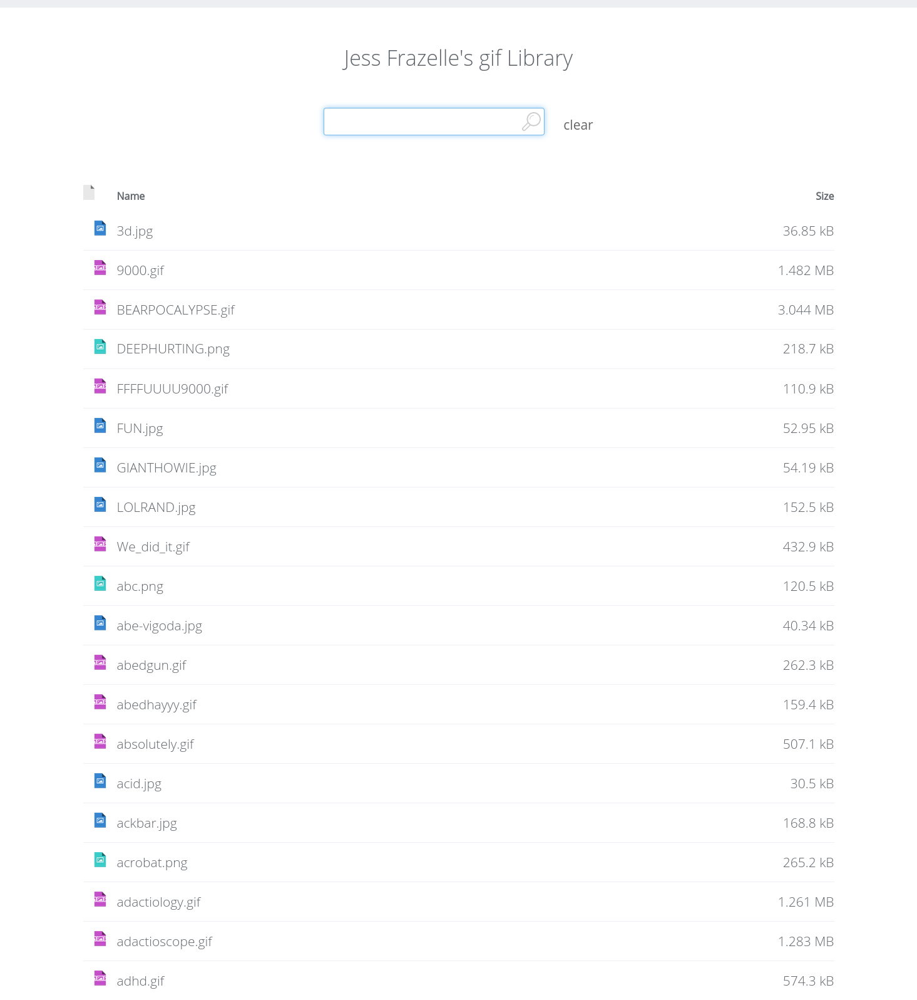

s3server
========

[](https://travis-ci.org/jfrazelle/s3server)

Static server for s3 files.

```console
$ s3server -h
Usage of ./s3server:
  -bucket string
    	bucket path from which to serve files
  -cert string
    	path to ssl certificate
  -key string
    	path to ssl key
  -p string
    	port for server to run on (default "8080")
  -provider string
    	cloud provider (ex. s3, gcs) (default "s3")
  -s3key string
    	s3 access key
  -s3region string
    	aws region for the bucket (default "us-west-2")
  -s3secret string
    	s3 access secret
```

**run with the docker image**

```console
$ docker run -d \
    --restart always \
    -e AWS_ACCESS_KEY_ID \
    -e AWS_SECRET_ACCESS_KEY \
    -p 8080:8080 \
    --name s3server \
    jess/s3server -bucket s3://hugthief/gifs
```


